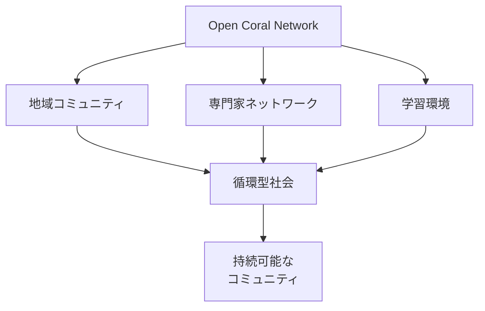
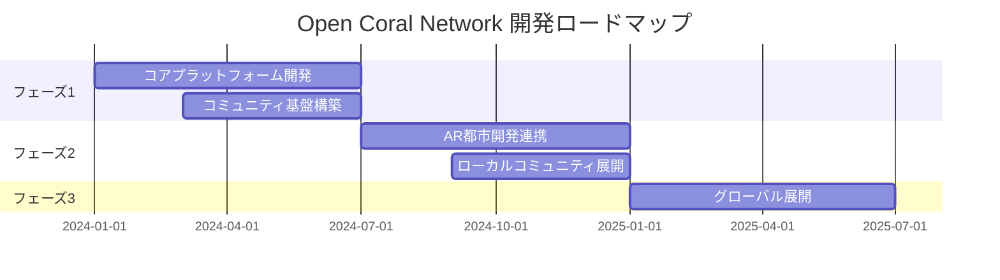

# 🌊 Open Coral Network

<div align="center">

[](https://opensource.org/licenses/MIT)
[](CONTRIBUTING.md)
[](CODE_OF_CONDUCT.md)

```ascii
    ______                     ______                __   _   __     __                      __  
   / ____/___  ___  ____     / ____/___  _________ / /  / | / /__  / /__      ______  ____/ /__
  / __/ / __ \/ _ \/ __ \   / /   / __ \/ ___/ __  /  /  |/ / _ \/ __/ | /| / / __ \/ __  / _ \
 / /___/ /_/ /  __/ / / /  / /___/ /_/ / /  / /_/ /  / /|  /  __/ /_ | |/ |/ / /_/ / /_/ /  __/
/_____/\____/\___/_/ /_/   \____/\____/_/   \__,_/  /_/ |_/\___/\__/ |__/|__/\____/\__,_/\___/ 
```

[English](README_EN.md) | 日本語

分散型ソーシャルネットワークを通じて、本質的な人と人とのつながりを取り戻す

[始める](#始める) • [機能](#機能) • [貢献する](#貢献する) • [ロードマップ](#ロードマップ)

</div>

## 💫 概要

Open Coral Networkは、人と人との本質的なつながりを取り戻すことを目指す、新しい形の分散型ソーシャルネットワーク（プロソーシャルメディア）です。インターネットを通じて、意味のあるローカルコミュニティの形成を支援します。

## 🎯 ビジョン



私たちは、テクノロジーを活用しながらも、人間本来の価値あるつながりを大切にするコミュニティの構築を目指しています。サンゴ礁の生態系のように、地域に根ざし、自然と調和した持続可能なコミュニティの形成を目指しています。

## ⚡ 特徴

| 機能 | 説明 | 状態 |
|------|------|------|
| 分散型設計 | 中央集権的なプラットフォームではなく、コミュニティ主導の分散型ネットワーク | 🚧 開発中 |
| ローカルフォーカス | 地域に根ざしたコミュニティ形成の促進 | 🚧 開発中 |
| プロフェッショナルネットワーク | 様々な分野の専門家や学習者が集まり、知識を共有 | 🚧 開発中 |
| AR都市開発連携 | ローカルな都市をARでデザイン | 🎯 計画中 |

## 🌟 主な対象分野

<div align="center">

```ascii
┌─────────────────┐   ┌─────────────────┐   ┌─────────────────┐
│   Programming   │   │       AI        │   │       IT        │
└────────┬────────┘   └────────┬────────┘   └────────┬────────┘
         │                     │                      │
         └──────────┬─────────┴──────────┬──────────┘
                    │                     │
            ┌──────┴──────┐       ┌──────┴──────┐
            │     Art     │       │    Music    │
            └──────┬──────┘       └──────┬──────┘
                   │                     │
                   └──────────┬─────────┘
                             │
                     ┌───────┴───────┐
                     │     Food      │
                     └───────────────┘
```

</div>

## 🌿 コミュニティの概念

サンゴ礁の生態系をモデルとしています：

<div align="center">

```ascii
          持続可能な関係構築
                 ↑
    自然との調和 → 地域との融合
                 ↓
          循環型の社会形成
```

</div>

## 📈 ロードマップ



## 🚀 始める

1. リポジトリをクローン
```bash
git clone https://github.com/your-username/Coral-Network.git
```

2. 依存関係をインストール
```bash
cd Coral-Network
npm install
```

3. 開発サーバーを起動
```bash
npm run dev
```

## 👥 コミュニティに参加する

- [GitHub Discussions](https://github.com/your-username/Coral-Network/discussions)で議論に参加
- [貢献ガイドライン](CONTRIBUTING.md)を確認
- [行動規範](CODE_OF_CONDUCT.md)を確認

## 📜 ライセンス

このプロジェクトは[MITライセンス](LICENSE)の下で公開されています。

---

<div align="center">

**[トップへ戻る](#)**

このプロジェクトは、人と人とのつながりを再構築し、より良い社会の形成を目指しています。皆様のご参加をお待ちしています。

</div>
