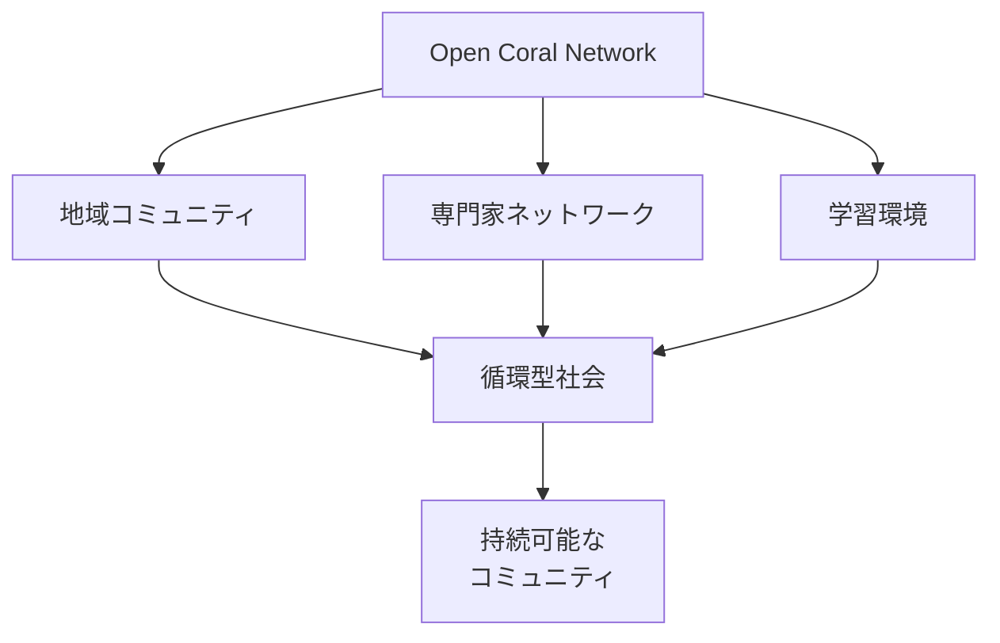
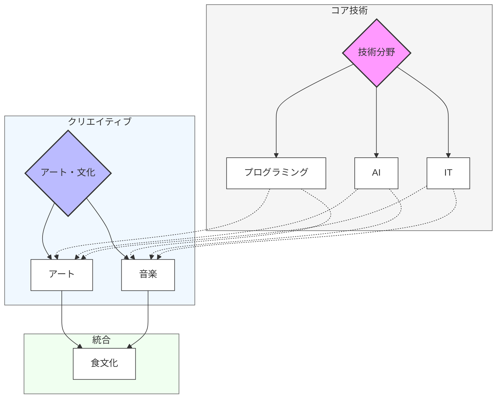
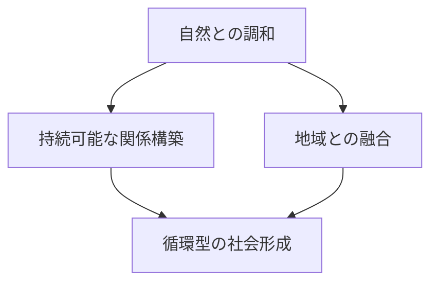
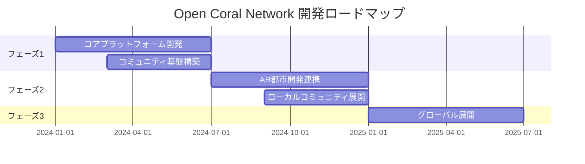

# 🌊 Open Coral Network

<div align="center">

[](https://opensource.org/licenses/MIT)
[](CONTRIBUTING.md)
[](CODE_OF_CONDUCT.md)

```ascii
    ______                     ______                __   _   __     __                      __  
   / ____/___  ___  ____     / ____/___  _________ / /  / | / /__  / /__      ______  ____/ /__
  / __/ / __ \/ _ \/ __ \   / /   / __ \/ ___/ __  /  /  |/ / _ \/ __/ | /| / / __ \/ __  / _ \
 / /___/ /_/ /  __/ / / /  / /___/ /_/ / /  / /_/ /  / /|  /  __/ /_ | |/ |/ / /_/ / /_/ /  __/
/_____/\____/\___/_/ /_/   \____/\____/_/   \__,_/  /_/ |_/\___/\__/ |__/|__/\____/\__,_/\___/ 
```

[English](README_EN.md) | 日本語

分散型ソーシャルネットワークを通じて、本質的な人と人とのつながりを取り戻す

[始める](#始める) • [機能](#機能) • [貢献する](#貢献する) • [ロードマップ](#ロードマップ)

</div>

## 💫 概要

Open Coral Networkは、インターネットを通じてローカルなコミュニティの形成を目的とする分散型ソーシャルネットワーク（プロソーシャルメディア）です。

### なぜ「Coral（サンゴ）」なのか

私たちはサンゴ礁の生態系をモデルとしています：
- 自然と調和し、地域と融合する
- 多様な「魚」（コミュニティメンバー）を呼び込む
- 循環型の社会を形成する
- 地域に根差したコミュニティを育む

### プロジェクトの特徴

1. **多様な専門家コミュニティ**
   - プログラミング、AI、IT
   - アート、音楽、食
   - 各分野のプロフェッショナルと学習者が集まる
   - 相互リスペクトに基づく学びの場を提供

2. **つながりの質**
   - マッチングによる適切な出会い
   - 継続的な関係構築
   - プロジェクト単位でのコラボレーション
   - 本質的な人間関係の再構築

3. **未来志向の取り組み**
   - AR都市開発との連携
   - ローカル都市のARデザイン
   - コミュニティとの高いシナジー効果

### 私たちのミッション

- 世界中の人々の参加を促進
- NPOとして無料でサービスを提供
- 本来の人間らしいつながりを取り戻す
- グローバルなムーブメントの創出

## 🎯 ビジョン



私たちは、テクノロジーを活用しながらも、人間本来の価値あるつながりを大切にするコミュニティの構築を目指しています。サンゴ礁の生態系のように、地域に根差し、自然と調和した持続可能なコミュニティの形成を目指しています。

## ✨ UI/UX設計
非エンジニアでも使いやすいUI/UX設計を目指しています。

- **非エンジニアフレンドリー**: コードベースではなく、ビジュアル中心のインターフェース
- **直感的な操作性**: ドラッグ＆ドロップなどの操作で簡単にプロジェクトを管理
- **進捗の可視化**: カンバンボードやタイムラインでプロジェクトの進捗状況を把握
- **メディアプレビュー**: 画像・音楽・動画などのコンテンツをUI上で確認

### 具体的なUI要素

- **カンバンボード**
  - プロジェクトのタスクをフェーズごとに表示し、ドラッグ＆ドロップで移動可能にします。
  - 各タスクカードには、担当者、期日、優先度などの情報を表示します。
  - 各フェーズの進捗状況をグラフなどで可視化します。

- **タイムライン**
  - プロジェクトの活動履歴をタイムライン形式で表示します。
  - プロジェクトの開始、タスクの追加、進捗状況の更新などのイベントをタイムライン上に表示します。
  - 各イベントをクリックすると、詳細情報を表示します。
  - タイムラインをSNS風のデザインにし、ユーザーのエンゲージメントを高めます。

- **メディアプレビュー**
  - プロジェクトで使用する画像、音楽、動画などのメディアファイルをUI上でプレビュー表示します。
  - 各メディアファイルはカード形式で表示し、クリックすると拡大表示や再生が可能です。
  - メディアファイルの種類に応じて、適切なプレビュー表示を行います。

- **プロジェクト提案フォーム**
  - 新しいプロジェクトを提案するためのフォームをUI上に用意します。
  - フォームには、プロジェクト名、ミッション、目標、進行ルール、募集メンバーなどの項目を設定します。
  - テンプレート機能を用意し、初心者でも簡単にプロジェクト提案を作成できるようにします。

- **投票機能**
  - プロジェクト提案に対する投票機能をUI上に用意します。
  - ユーザーは提案内容を評価し、「いいね」やコメントでフィードバック可能です。
  - 一定以上の支持を得たプロジェクトを「公式プロジェクト」として昇格させます。

- **貢献ポイント表示**
  - ユーザーのプロジェクト貢献度を可視化するために、貢献ポイントを表示します。
  - プロジェクトへの参加、タスクの完了、アイデアの提供など、貢献内容に応じてポイントを付与します。
  - 貢献度ランキングを表示し、ユーザーのモチベーションを高めます。

- **仮想イベントスペース**
  - プロジェクトごとに仮想イベントスペース（バーチャル作業部屋）を提供します。
  - テキストチャット、ボイスチャット、画面共有などの機能を提供します。
  - 音楽を共有したり、ゲームをしながら作業できるなど、エンタメ要素を取り入れます。

## ⚡ 特徴

| 機能 | 説明 | 状態 |
|------|------|------|
| 分散型設計 | 中央集権的なプラットフォームではなく、コミュニティ主導の分散型ネットワーク | 🚧 開発中 |
| ローカルフォーカス | 地域に根差したコミュニティ形成の促進 | 🚧 開発中 |
| プロフェッショナルネットワーク | 様々な分野の専門家や学習者が集まり、知識を共有 | 🚧 開発中 |
| AR都市開発連携 | ローカルな都市をARでデザイン | 🎯 計画中 |

## 🌟 主な対象分野



## 🌿 コミュニティの概念

サンゴ礁の生態系をモデルとしています：



## � ロードマップ



## 🚀 始める

1. リポジトリをクローン
```bash
git clone https://github.com/your-username/Coral-Network.git
```

2. 依存関係をインストール
```bash
cd Coral-Network
npm install
```

3. 開発サーバーを起動
```bash
npm run dev
```

## 👥 コミュニティに参加する

- [GitHub Discussions](https://github.com/your-username/Coral-Network/discussions)で議論に参加
- [貢献ガイドライン](CONTRIBUTING.md)を確認
- [行動規範](CODE_OF_CONDUCT.md)を確認

## 📜 ライセンス

このプロジェクトは[MITライセンス](LICENSE)の下で公開されています。

---

<div align="center">

このプロジェクトは、人と人とのつながりを再構築し、より良い社会の形成を目指しています。皆様のご参加をお待ちしています。

**[トップへ戻る](#)**

</div>
