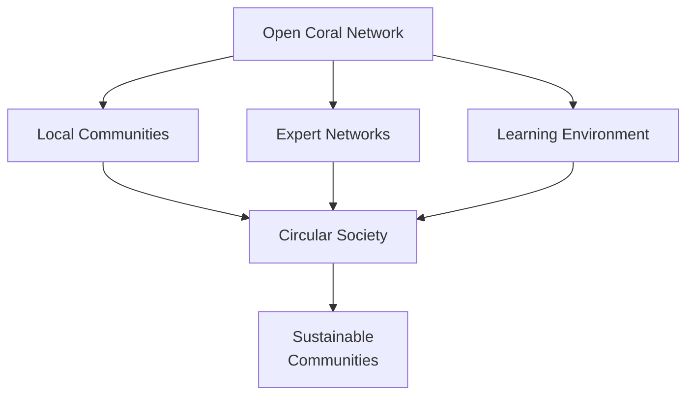
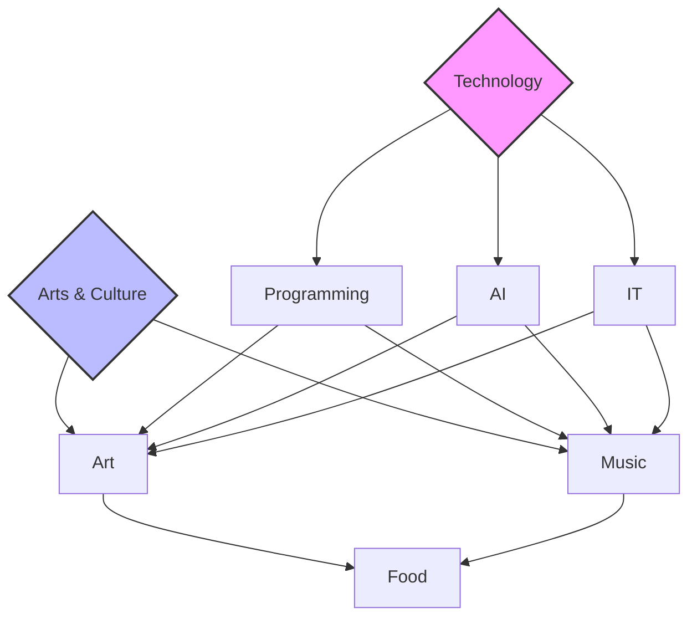
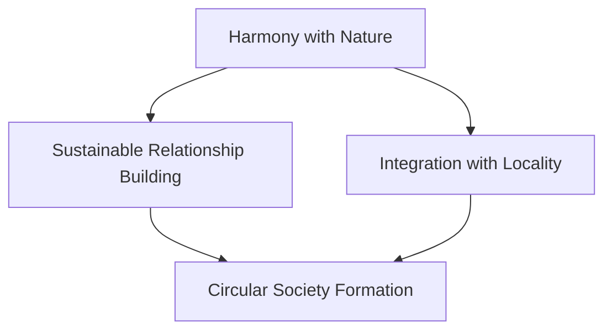
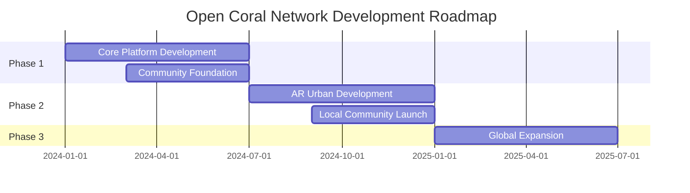

# 🌊 Open Coral Network

<div align="center">

[](https://opensource.org/licenses/MIT)
[](CONTRIBUTING.md)
[](CODE_OF_CONDUCT.md)

```ascii
    ______                     ______                __   _   __     __                      __  
   / ____/___  ___  ____     / ____/___  _________ / /  / | / /__  / /__      ______  ____/ /__
  / __/ / __ \/ _ \/ __ \   / /   / __ \/ ___/ __  /  /  |/ / _ \/ __/ | /| / / __ \/ __  / _ \
 / /___/ /_/ /  __/ / / /  / /___/ /_/ / /  / /_/ /  / /|  /  __/ /_ | |/ |/ / /_/ / /_/ /  __/
/_____/\____/\___/_/ /_/   \____/\____/_/   \__,_/  /_/ |_/\___/\__/ |__/|__/\____/\__,_/\___/ 
```

[日本語](README.md) | English

Restoring authentic human connections through decentralized social networking

[Getting Started](#getting-started) • [Features](#features) • [Contributing](#contributing) • [Roadmap](#roadmap)

</div>

## 💫 Overview

Open Coral Network is a decentralized social network (pro-social media) designed to facilitate local community formation through the internet.

### Why "Coral"?

Our model is inspired by coral reef ecosystems:
- Harmony with nature and integration with local regions
- Attracting diverse "fish" (community members)
- Creating a circular society
- Nurturing community roots in local areas

### Project Features

1. **Diverse Professional Community**
   - Programming, AI, IT
   - Art, Music, Food
   - Gathering of professionals and learners across fields
   - Learning environment based on mutual respect

2. **Quality Connections**
   - Smart matching for meaningful encounters
   - Building lasting relationships
   - Project-based collaboration
   - Rebuilding authentic human connections

3. **Future-Oriented Initiatives**
   - Integration with AR Urban Development
   - AR Design for local cities
   - High synergy with community values

### Our Mission

- Encourage worldwide participation
- Provide services free of charge as an NPO
- Restore authentic human connections
- Create a global movement

## 🎯 Vision



While leveraging technology, we aim to build communities that value authentic human connections. Like a coral reef ecosystem, we strive to create sustainable communities that are rooted in their localities and in harmony with nature.

## ⚡ Features

| Feature | Description | Status |
|---------|-------------|--------|
| Decentralized Design | Community-driven network rather than centralized platform | 🚧 In Development |
| Local Focus | Promoting community formation rooted in local areas | 🚧 In Development |
| Professional Network | Knowledge sharing among experts and learners from various fields | 🚧 In Development |
| AR Urban Development | Design local cities through AR technology | 🎯 Planned |

## 🌟 Key Focus Areas



## 🌿 Community Concept

Modeled after coral reef ecosystems:



## 📈 Roadmap



## 🚀 Getting Started

1. Clone the repository
```bash
git clone https://github.com/your-username/Coral-Network.git
```

2. Install dependencies
```bash
cd Coral-Network
npm install
```

3. Start the development server
```bash
npm run dev
```

## 👥 Join the Community

- Join discussions on [GitHub Discussions](https://github.com/your-username/Coral-Network/discussions)
- Check our [Contribution Guidelines](CONTRIBUTING.md)
- Review our [Code of Conduct](CODE_OF_CONDUCT.md)

## 📜 License

This project is licensed under the [MIT License](LICENSE).

---

<div align="center">

This project aims to rebuild human connections and create a better society. We welcome your participation.

**[Back to Top](#)**

</div>
