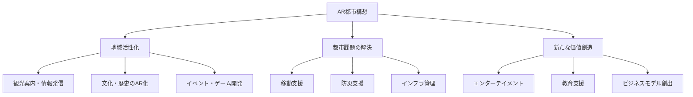
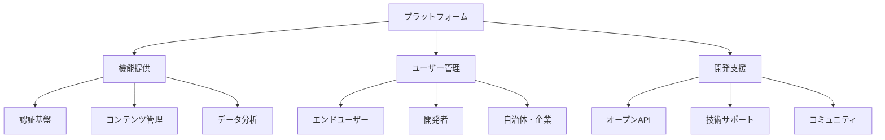
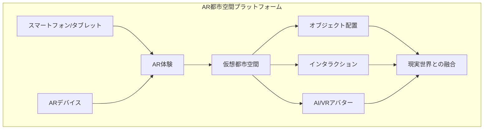
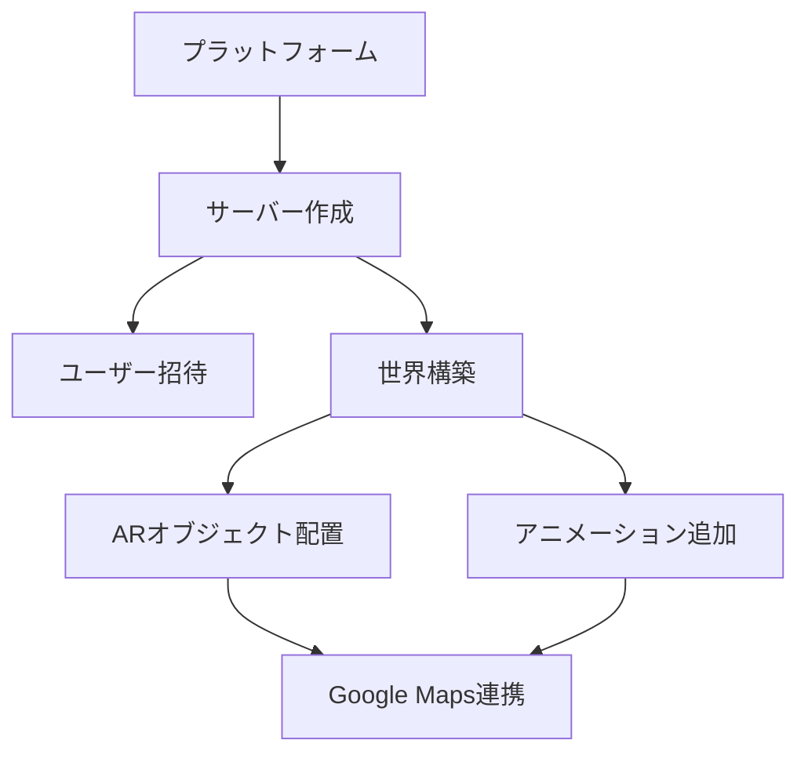
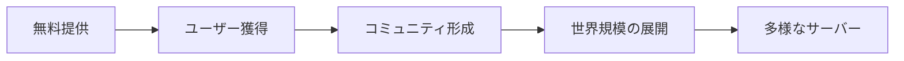
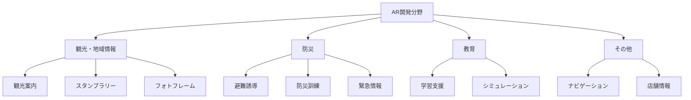

# AR都市構想プロジェクト

[English version](ar_urban_development_en.md)

> 📋 **概要**  
> 本プロジェクトは、AR（拡張現実）技術を活用して、都市や地域の課題を解決し、新たな価値を創出することを目指しています。地域活性化、観光促進、防災、教育など、多岐にわたる分野での応用を視野に入れ、人々の生活を豊かにするAR体験を提供します。

> 🌟 **背景**  
> 現代の都市は、人口減少、高齢化、インフラの老朽化、環境問題など、多くの課題に直面しています。これらの課題を解決するためには、革新的な技術の導入が不可欠です。AR技術は、現実世界にデジタル情報を重ね合わせることで、人々の認識や行動を拡張し、これらの課題に対する新たなソリューションを提供できる可能性を秘めています。

## プロジェクトの目的

| 分野 | 目的 | 具体的な施策 |
|------|------|--------------|
| 地域活性化 | 交流人口の増加 | - AR観光案内 - 地域情報の発信 - ARイベント開発 |
| 都市課題解決 | 都市機能の向上 | - ARナビゲーション - 防災訓練支援 - インフラ点検 |
| 価値創造 | 新規ビジネス創出 | - AR体験提供 - 教育コンテンツ開発 - 経済活性化 |

## プラットフォーム戦略

### プラットフォームの概要

| 機能 | 説明 | 特徴 |
|------|------|------|
| 認証基盤 | OAuth 2.0対応 | セキュアな認証 |
| コンテンツ管理 | メタデータ・バージョン管理 | 多言語対応 |
| データ分析 | 利用状況・評価分析 | 改善サイクル |
| API Gateway | 効率的なアクセス処理 | 高性能 |

### 技術戦略

| 項目 | 技術選定 | 理由 |
|------|----------|------|
| AR基盤 | ARKit/ARCore | デバイス互換性 |
| AI活用 | 生成AI | コンテンツ自動生成 |
| データベース | Supabase | スケーラビリティ |
| リージョン | Tokyo | 法規制対応 |

### マネタイズ戦略

| モデル | 内容 | 特徴 |
|--------|------|------|
| 無料プラン | 基本機能提供 | ユーザー獲得 |
| 有料プラン | 高度機能提供 | 収益基盤 |
| 手数料 | コンテンツ販売 | 持続可能性 |
| 広告 | AR広告掲載 | 追加収益 |

## AR都市構想の詳細

### プロジェクトの詳細説明

このプロジェクトでは、ユーザーがAR都市空間を構築・体験するためのプラットフォームを、スマートフォン、タブレット、ARデバイスで利用できるアプリケーションとして提供します。

**主な特徴**

ユーザーは自身のスマートフォンやタブレット、あるいはARデバイスを通じて、現実世界に重ねて表示される仮想の都市空間を自由に構築し、体験することができます。

**革新的な体験**

このプラットフォームは、単なるシミュレーションに留まらず、他のユーザーとのインタラクションや、AI、VRアバターとの連携を通じて、現実世界と仮想世界が融合した新しい体験を提供します。

### 主要機能

- **マルチデバイス対応**
  - スマートフォン
  - タブレット
  - ARデバイス

- **都市空間構築機能**
  - 仮想オブジェクトの配置
  - リアルタイム編集
  - 複数ユーザーでの共同作業

- **インタラクティブ体験**
  - ユーザー間のリアルタイム交流
  - AIキャラクターとの対話
  - VRアバターとの連携

### 特徴的な機能

1. **現実世界との融合**
   - 実在する都市空間への重ね合わせ
   - 地理情報との連携
   - シームレスな拡張現実体験

2. **コミュニティ機能**
   - グループでの都市開発
   - 作品の共有と評価
   - イベント開催機能

3. **AI・VR統合**
   - インテリジェントなNPC配置
   - アバターカスタマイズ
   - 動的なシナリオ生成

## プラットフォームのワークフロー

### サービスの特徴

| 機能 | 説明 | メリット |
|------|------|----------|
| サーバー作成 | ユーザーが独自のサーバーを作成可能 | コミュニティ形成が容易 |
| ARオブジェクト配置 | 自由な場所にオブジェクトを設置 | 創造性を活かした都市デザイン |
| Google Maps連携 | リアルな地図上での作成 | 現実世界との連携 |
| アニメーション機能 | オブジェクトに動きを追加 | よりダイナミックな表現が可能 |

## プラットフォームの展開とマネタイズ

### 展開戦略

1. **無料提供からスタート**
   - 誰でも気軽に利用可能
   - マインクラフトのような世界作り体験
   - 現実世界とのリンク

2. **グローバル展開**

3. **サーバーの活用例**
   - アーティストによる独自空間の創造
   - 数百〜数千人規模のコミュニティ形成
   - 企業のPR活動の場として活用

### マネタイズ戦略

| 収益モデル | 内容 | 特徴 |
|------------|------|------|
| ブロックチェーン活用 | AR都市内でのグッズ販売 | デジタル資産としての価値 |
| サブスクリプション | サーバーへの参加費用 | 継続的な収益 |
| 企業利用 | PR活動の場としての活用 | B2Bビジネスの展開 |

## アプリケーション開発とコミュニティ

### アプリケーション分野

| 分野 | アプリケーション | コミュニティ貢献 |
|------|------------------|------------------|
| 観光 | AR観光案内 | - アイデア出し - 情報収集 - 翻訳 |
| 防災 | AR避難誘導 | - 経路検証 - 情報提供 - テスト |
| 教育 | AR学習支援 | - コンテンツ作成 - 評価 - 改善提案 |

### 実証実験と社会実装

#### 実証実験
- 特定の地域や施設でARアプリケーションの実証実験を行い、効果や課題を検証します。
- 地域住民や利用者のフィードバックを収集し、改善に繋げます。
- **コミュニティーでの貢献:**
  - 実証実験への参加
  - フィードバックの提供
  - 広報活動

#### 社会実装
- 実証実験の結果を踏まえ、ARアプリケーションの本格的な社会実装を目指します。
- 地方自治体や企業との連携を強化し、持続可能な運営体制を構築します。
- **コミュニティーでの貢献:**
  - 運営体制への参加
  - 継続的なフィードバック
  - 地域への働きかけ
