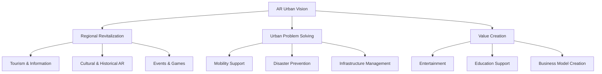
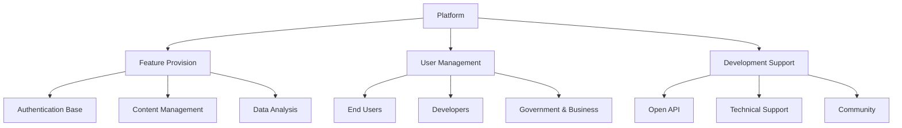
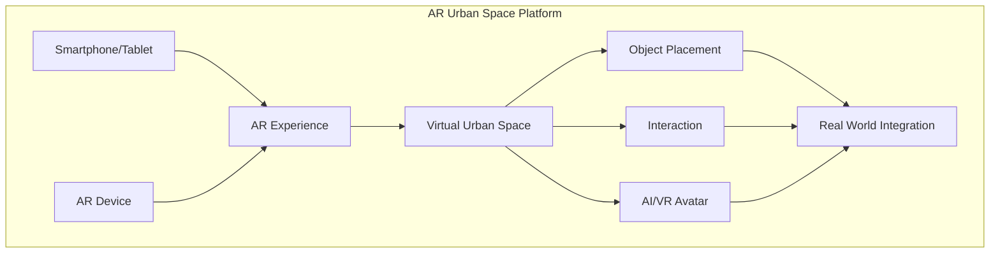
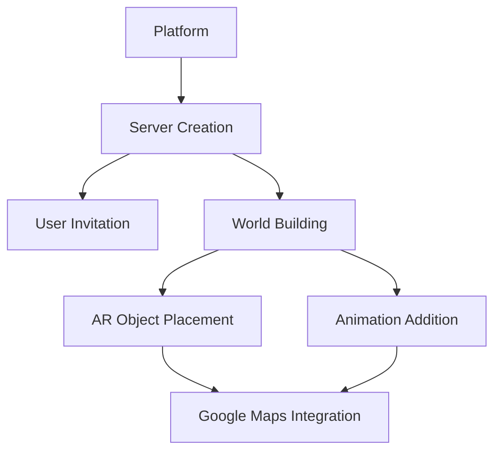
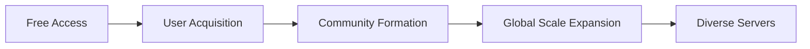
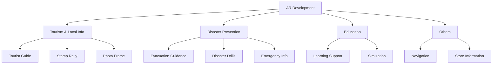

# AR Urban Development Project

[日本語版](ar_urban_development.md)

> 📋 **Overview**  
> This project aims to leverage AR (Augmented Reality) technology to solve urban and regional challenges while creating new value. With applications spanning regional revitalization, tourism promotion, disaster prevention, and education, we provide AR experiences that enrich people's lives.

> 🌟 **Background**  
> Modern cities face numerous challenges, including population decline, aging society, infrastructure deterioration, and environmental issues. Introducing innovative technology is essential to address these challenges. AR technology has the potential to provide new solutions by overlaying digital information onto the real world, expanding people's perception and behavior.

## Project Objectives

| Area | Objective | Specific Measures |
|------|-----------|------------------|
| Regional Revitalization | Increase visitor traffic | - AR tourism guide - Local information sharing - AR event development |
| Urban Problem Solving | Improve urban functions | - AR navigation - Disaster drill support - Infrastructure inspection |
| Value Creation | New business creation | - AR experience provision - Educational content development - Economic revitalization |

## Platform Strategy

### Platform Overview

| Function | Description | Features |
|----------|-------------|----------|
| Authentication | OAuth 2.0 Support | Secure Authentication |
| Content Management | Metadata & Version Control | Multilingual Support |
| Data Analysis | Usage & Evaluation Analysis | Improvement Cycle |
| API Gateway | Efficient Access Processing | High Performance |

### Technical Strategy

| Item | Technology Choice | Reason |
|------|------------------|---------|
| AR Foundation | ARKit/ARCore | Device Compatibility |
| AI Integration | Generative AI | Content Auto-generation |
| Database | Supabase | Scalability |
| Region | Tokyo | Regulatory Compliance |

### Monetization Strategy

| Model | Content | Features |
|-------|---------|----------|
| Free Plan | Basic Feature Access | User Acquisition |
| Paid Plan | Advanced Feature Access | Revenue Base |
| Commission | Content Sales | Sustainability |
| Advertising | AR Ad Placement | Additional Revenue |

## AR Urban Vision Details

### Project Details

This project provides a platform for users to build and experience AR urban spaces through applications available on smartphones, tablets, and AR devices.

**Key Features**

Users can freely construct and experience virtual urban spaces overlaid on the real world through their smartphones, tablets, or AR devices.

**Innovative Experience**

This platform goes beyond mere simulation, offering new experiences that merge real and virtual worlds through user interactions, AI, and VR avatar integration.

### Core Functions

- **Multi-device Support**
  - Smartphones
  - Tablets
  - AR Devices

- **Urban Space Construction**
  - Virtual Object Placement
  - Real-time Editing
  - Multi-user Collaboration

- **Interactive Experience**
  - Real-time User Interaction
  - AI Character Dialogue
  - VR Avatar Integration

### Distinctive Features

1. **Real World Integration**
   - Overlay on Existing Urban Spaces
   - Geographic Information Integration
   - Seamless AR Experience

2. **Community Features**
   - Group Urban Development
   - Work Sharing and Evaluation
   - Event Hosting Capabilities

3. **AI & VR Integration**
   - Intelligent NPC Placement
   - Avatar Customization
   - Dynamic Scenario Generation

## Platform Workflow

### Service Features

| Function | Description | Benefits |
|----------|-------------|-----------|
| Server Creation | Users can create their own servers | Easy community formation |
| AR Object Placement | Free object placement | Creative urban design |
| Google Maps Integration | Creation on real maps | Real-world connection |
| Animation Function | Object animation | More dynamic expression |

## Platform Development and Monetization

### Development Strategy

1. **Start with Free Access**
   - Easy access for everyone
   - Minecraft-like world building experience
   - Real-world connection

2. **Global Expansion**

3. **Server Usage Examples**
   - Artist-created unique spaces
   - Communities of hundreds to thousands
   - Corporate PR platform

### Monetization Strategy

| Revenue Model | Content | Features |
|--------------|---------|-----------|
| Blockchain Integration | AR City Goods Sales | Digital Asset Value |
| Subscription | Server Access Fees | Continuous Revenue |
| Corporate Use | PR Platform Usage | B2B Business Development |

## Application Development and Community

### Application Areas

| Field | Application | Community Contribution |
|-------|-------------|----------------------|
| Tourism | AR Tourist Guide | - Idea Generation - Information Collection - Translation |
| Disaster Prevention | AR Evacuation Guide | - Route Verification - Information Provision - Testing |
| Education | AR Learning Support | - Content Creation - Evaluation - Improvement Suggestions |

### Pilot Testing and Social Implementation

#### Pilot Testing
- Conduct AR application pilot tests in specific areas and facilities to verify effectiveness and identify challenges
- Collect feedback from local residents and users for improvements
- **Community Contributions:**
  - Pilot test participation
  - Feedback provision
  - Public relations activities

#### Social Implementation
- Aim for full-scale social implementation of AR applications based on pilot test results
- Strengthen partnerships with local governments and businesses for sustainable operations
- **Community Contributions:**
  - Operational structure participation
  - Continuous feedback
  - Community engagement
